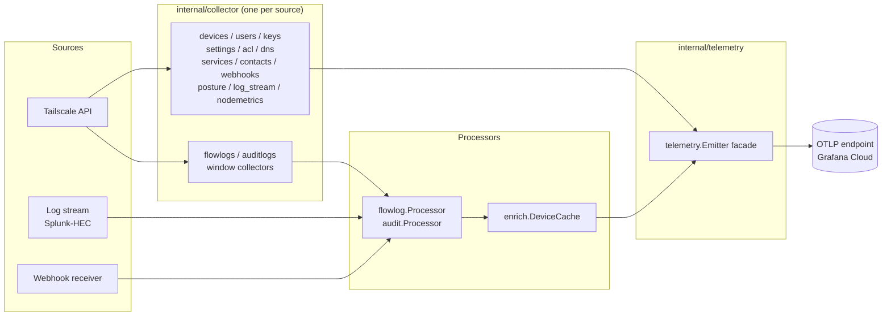

# Architecture

`tailscale2otel` is a single static Go binary that bridges the Tailscale observability surface to
any OpenTelemetry backend. It polls the Tailscale API (and optionally receives streamed logs or
webhooks), runs each data source through a typed conversion pipeline, and pushes the resulting
metrics and logs (and, optionally, self-observability traces) over OTLP — all without writing a
single line of PromQL or touching a sidecar.

## High-level data flow

Collectors and processors emit only through the `telemetry.Emitter` interface — they never touch
the OTEL SDK directly. This keeps OTLP a deployment concern, not a business-logic concern.

## Composition root — `internal/app`

`app.New` is where everything gets wired together. On startup it:

1. Builds the OTEL telemetry provider (gRPC/HTTP/stdout exporter, cumulative temporality for
   Grafana Cloud).
2. Constructs the Tailscale API client (`internal/tsapi`) with either OAuth (preferred —
   auto-refreshing, no expiry) or a static API key.
3. Creates the shared `flowlog.Processor` and `audit.Processor` so both the poll path and the
   stream/webhook path feed identical conversion logic.
4. Initialises the in-memory device enrichment cache (`internal/enrich`).
5. Registers every enabled collector with the scheduler (`internal/collector`).
6. Starts any enabled receivers (`internal/stream` for Splunk-HEC, `internal/webhook`).
7. Launches the admin HTTP server (health probes, status page, optional pprof).

The file `internal/app/collectors.go` is the canonical list of what is registered and under what
config gates. Start here when you want to understand how a new data source would be added.

## Collector types and scheduling

`internal/collector` defines two interfaces:

- **`SnapshotCollector`** — a point-in-time read, called on a fixed interval. Used by `devices`,
  `users`, `keys`, `settings`, `acl`, `dns`, `services`, `contacts`, `webhooks`,
  `posture_integrations`, `log_stream`, and `nodemetrics`. Stateless between ticks (the `acl`
  collector is the exception: it stores an ETag to skip unchanged responses).
- **`WindowCollector`** — a time-windowed read, called with an explicit `[from, to]` range. Used
  by `flowlogs` and `auditlogs`. Each run returns a high-water mark that becomes the `from` of the
  next window, enabling resumable polling across restarts.

Each collector runs in its own goroutine with a small randomised start-up stagger (bounded at 3 s
by default) so no two collectors hit the API at the same instant. A panic or transient error in one
tick is recovered and logged; it never stops the scheduler or any other collector.

## Poll vs. stream — pick one per log type

For flow logs and audit logs there are two ingestion paths:

- **Poll** (`source: poll`): the window collector periodically calls the Tailscale Logs API and
  processes the batch.
- **Stream** (`source: stream`): tailscale2otel runs a built-in Splunk-HEC-compatible receiver;
  Tailscale pushes records to it in near-real time.

**You must choose exactly one path per log type.** Running both double-counts records. A best-effort
bounded FIFO de-duplicate set (`internal/dedup`) can suppress exact duplicates across paths, but it
is a failsafe, not a substitute for correct configuration. The app logs a WARNING at startup if both
paths are active for the same log type. See [Streaming & Webhooks](streaming-webhooks.md) for
receiver setup.

Crucially, both paths feed the _same_ `flowlog.Processor` / `audit.Processor`, so the emitted
signals are identical regardless of which path delivers the record.

## Device enrichment

The `devices` collector populates an in-memory cache (`internal/enrich.DeviceCache`) that maps IP
addresses and node IDs to human-readable device names. The flow-log and audit processors consult
this cache when annotating log records and metrics with `source.address` / `destination.address`
labels.

!!! warning "Degraded enrichment without the devices collector"
    If the `devices` collector is disabled, the enrichment cache is empty and flow/audit records
    fall back to `unknown` (for unresolvable internal IPs) or `external` (for addresses outside the
    tailnet). Device-name labels will be absent or generic until the collector is re-enabled and has
    run at least once.

## Checkpointing

Window collectors persist their high-water marks via `internal/collector.CheckpointStore`. By
default this is a file (`checkpoints.json` next to the binary), written atomically on each
successful tick. On a clean restart the collector resumes from the last saved mark rather than
re-fetching the full history; on cold start (no checkpoint) it applies the configured
`initial_lookback` window. In-memory checkpointing is also available (useful for ephemeral
containers where durability is handled externally).

If a window collection fails the high-water mark is **not** advanced, so the same window is
retried on the next tick.

## Self-observability and the admin status page

tailscale2otel emits its own health signals as OTLP metrics (see [Metrics](metrics.md) for the
full catalog):

- `tailscale2otel.scrape.*` — per-collector duration, success/failure counts, last-run timestamp,
  staleness (seconds since last success), and budget (last duration ÷ interval; ≥ 1 means risk of
  interval overrun), tagged with `tailscale.collector`.
- `tailscale2otel.up` — overall heartbeat gauge.
- `tailscale2otel.series.*` — per-source-metric active time-series count (`series.active`, pinned at
  the cap), the effective cap itself (`series.limit`, omitted when unlimited), and a 0/1 overflow flag
  (`series.overflowing`) that fires when excess series are silently dropped into `otel_metric_overflow`.
  Together these let you alert on cardinality cap hits without hardcoding the limit in PromQL.
- `tailscale2otel.api.requests` / `api.retries` — Tailscale API call counters, plus
  `tailscale2otel.api.duration` — a per-request latency histogram (with trace exemplars when
  `tracing.enabled`).
- **Export-cost & ingest volume (C8):** `tailscale2otel.export.datapoints` / `export.log_records`
  (the DPM/log-cost proxy) and `tailscale2otel.ingest.records` / `ingest.size` (per poll/stream/webhook
  path), plus `tailscale2otel.series.by_group`.
- **Health (C9):** `tailscale2otel.config.warnings` / `config.valid` (runtime view of
  `Validate()`/`Warnings()`), the standard `process.uptime` / `process.cpu.time`, and checkpoint health
  (`checkpoint.disk.size`, `checkpoint.persist.age`). The dedup failsafe exposes
  `tailscale2otel.dedup.hits` (duplicates suppressed per set).
- **Receivers:** the Splunk-HEC and webhook receivers each emit `*.inflight` and `*.request.duration`
  alongside their record counters (see [Streaming & Webhooks](streaming-webhooks.md)).

When `tracing.enabled` is set, a `TracerProvider` is also built in `app.New` and the scheduler,
Tailscale API client, and receivers emit spans (one root span per scrape cycle, child spans per API
request, one span per receiver request) over the same `otlp.*` endpoint.

In addition, an admin HTTP server (default `:9090`) serves:

- `/` — an HTML status page with live collector health, cardinality table, the metrics/log catalog,
  discovered node-metrics targets, and a redacted config view.
- `/api/status.json` — the same data as JSON, for programmatic access.
- `/healthz` and `/readyz` — liveness and readiness probes.
- `/debug/pprof` — optional, requires `profiling.pprof.enabled: true` (which in turn requires
  `admin.enabled: true`).

The status page is entirely self-contained — no CDN or external assets — so it renders on
air-gapped tailnets.

## Key package boundaries

| Package | Role |
|---|---|
| `internal/app` | Composition root; wires all components together |
| `internal/collector/<name>` | One subpackage per data source; fetch + emit |
| `internal/flowlog`, `internal/audit` | Shared record types and processors |
| `internal/enrich` | In-memory device enrichment cache |
| `internal/telemetry` | `Emitter` facade; the only code that touches the OTEL SDK |
| `internal/tsapi` | Tailscale API client (OAuth / API key, retry, rate-limit handling) |
| `internal/stream`, `internal/webhook` | Alternate log ingestion receivers |
| `internal/config` | Layered config loader and validation |

See [Configuration](configuration.md) for the full config reference and [Metrics](metrics.md) for
every emitted signal.
