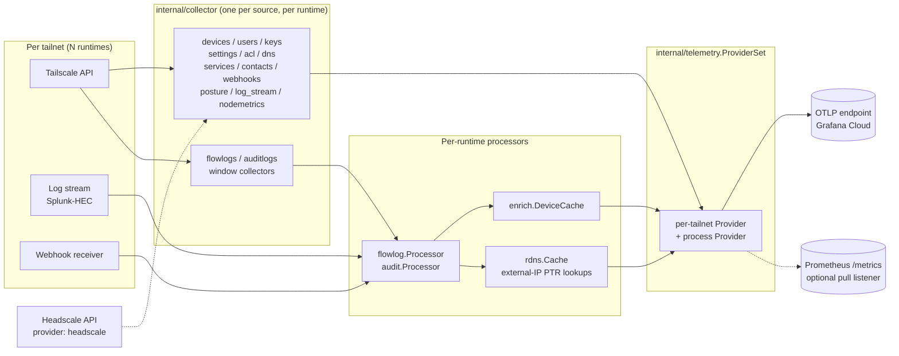

# Architecture

`tailscale2otel` is a single static Go binary that bridges the Tailscale observability surface to
any OpenTelemetry backend. It polls the Tailscale API (and optionally receives streamed logs or
webhooks), runs each data source through a typed conversion pipeline, and pushes the resulting
metrics and logs (and, optionally, self-observability traces) over OTLP — all without writing a
single line of PromQL or touching a sidecar.

## High-level data flow

`app.New` fans out over the configured tailnets: each gets its own `*tailnetRuntime` (client,
enrichment cache, scheduler, flow/audit processors), and every runtime feeds a per-tailnet
`telemetry.Provider` inside one process-wide `telemetry.ProviderSet`. Under `provider: headscale`
there is no fan-out — a single runtime talks to Headscale instead.

Collectors and processors emit only through the `telemetry.Emitter` interface — they never touch
the OTEL SDK directly. This keeps OTLP a deployment concern, not a business-logic concern.

## Control-plane providers: Tailscale or Headscale

By default tailscale2otel talks to Tailscale's hosted API. Setting `provider: headscale` points it
at a self-hosted [Headscale](https://headscale.net/) control plane instead, via `internal/hsapi`
behind the same `internal/provider` abstraction — the collectors and processors described above are
unaware of which backend is in play.

Headscale's API is narrower than Tailscale's, so under `provider: headscale` only the `devices`,
`users`, `keys`, `acl`, and `nodemetrics` collectors run; the Tailscale-only collectors (`flowlogs`,
`auditlogs`, `services`, `webhooks`, `contacts`, `posture_integrations`, `log_stream`, `settings`,
`dns`) auto-disable, and several device/user signals are reduced or omitted. See
[Configuration → `headscale`](configuration.md#headscale-headscale-control-plane-connection) for
the full list of what's affected and the required connection settings.

## Composition root — `internal/app`

`app.New` is where everything gets wired together. On startup it:

1. Resolves the configured tailnets (`cfg.ResolvedTailnets()` — one `tailscale:` block or a
   `tailnets:` list) and builds a `telemetry.ProviderSet`: one process-level OTEL provider (no
   `tailscale.tailnet` attribute; process/global self-obs) plus one per-tailnet provider (each
   stamps `tailscale.tailnet=<name>` and gets a distinct `service.instance.id`, so tailnets never
   collide on a shared Grafana Cloud backend).
2. Builds process-level shared dependencies (`buildProcessDeps`): the reverse-DNS cache
   (`internal/rdns`, gated by `enrichment.reverse_dns.enabled`), the webhook↔audit cross-dedup set
   (`internal/dedup`), and the release/version-check fetchers (`internal/release`, gated by
   `version_checks.self.enabled` / `version_checks.devices.enabled`).
3. Builds the collection machinery, branching on `provider`:
   - **`tailscale` (default):** one `*tailnetRuntime` per resolved tailnet. Each runtime gets its
     own `internal/tsapi` client (OAuth preferred — auto-refreshing, no expiry — or a static API
     key), its own `enrich.DeviceCache`, its own `flowlog.Processor` / `audit.Processor` pair (so
     both the poll path and the stream/webhook path feed identical conversion logic within that
     tailnet), and its own collector registry + scheduler (`internal/collector`).
   - **`headscale`:** a single runtime backed by `internal/hsapi` behind the `internal/provider`
     abstraction (`provider.Headscale`) — no per-tailnet fan-out; it shares the process emitter
     rather than getting its own tailnet provider.
4. Starts any enabled receivers (`internal/stream` for Splunk-HEC, `internal/webhook`).
5. Launches the admin HTTP server (health probes, status page, `POST /api/rdns/purge`, optional
   pprof) when `admin.enabled`.
6. Launches the standalone Prometheus pull-endpoint server (`internal/app/metrics.go`) when
   `prometheus.enabled`, serving the merged per-provider gatherers from the `ProviderSet`.
7. Starts continuous profiling (Pyroscope push agent) when configured; failure to reach Pyroscope
   is non-fatal.

`Run` then starts, per runtime, its scheduler loop plus (when self-observability is enabled) the
release-check background loops (`selfRelease.Run` / `tsRelease.Run`) driving
`tailscale2otel.update_available` and the device version-skew metrics.

The file `internal/app/collectors.go` is the canonical list of what is registered and under what
config gates. Start here when you want to understand how a new data source would be added.

There is no cross-process coordination anywhere in this pipeline — checkpoints, the dedup set, and
the enrichment cache are all in-process state. Run exactly one instance per tailnet (or one
instance covering the whole fleet via `tailnets:`); a second instance polling or streaming the same
tailnet double-counts flow/audit logs independently of the poll-vs-stream choice below. See
[Troubleshooting](troubleshooting.md#running-more-than-one-instance-against-the-same-tailnet-double-counts).

## Collector types and scheduling

`internal/collector` defines two interfaces:

- **`SnapshotCollector`** — a point-in-time read, called on a fixed interval. Used by `devices`,
  `users`, `keys`, `settings`, `acl`, `dns`, `services`, `contacts`, `webhooks`,
  `posture_integrations`, `log_stream`, and `nodemetrics`. Stateless between ticks (the `acl`
  collector is the exception: it stores an ETag to skip unchanged responses).
- **`WindowCollector`** — a time-windowed read, called with an explicit `[from, to]` range. Used
  by `flowlogs` and `auditlogs`. Each run returns a high-water mark that becomes the `from` of the
  next window, enabling resumable polling across restarts.

Each collector runs in its own goroutine with a small randomised start-up stagger (bounded at 3 s
by default) so no two collectors hit the API at the same instant. A panic or transient error in one
tick is recovered and logged; it never stops the scheduler or any other collector.

## Poll vs. stream — pick one per log type

For flow logs and audit logs there are two ingestion paths:

- **Poll** (`source: poll`): the window collector periodically calls the Tailscale Logs API and
  processes the batch.
- **Stream** (`source: stream`): tailscale2otel runs a built-in Splunk-HEC-compatible receiver;
  Tailscale pushes records to it in near-real time.

**You must choose exactly one path per log type.** Running both double-counts records. A best-effort
bounded FIFO de-duplicate set (`internal/dedup`) can suppress exact duplicates across paths, but it
is a failsafe, not a substitute for correct configuration. The app logs a WARNING at startup if both
paths are active for the same log type. See [Streaming & Webhooks](streaming-webhooks.md) for
receiver setup.

Crucially, both paths feed the _same_ `flowlog.Processor` / `audit.Processor`, so the emitted
signals are identical regardless of which path delivers the record.

## Device enrichment

Two enrichment layers feed source/destination naming on flow and audit records; the device cache
resolves **tailnet** addresses, reverse-DNS resolves **external** ones.

- **`internal/enrich.DeviceCache`** — populated by the `devices` collector, in-memory, one instance
  per `tailnetRuntime`. Maps IP addresses and node IDs *within that tailnet* to human-readable
  device names. The flow-log and audit processors consult this cache first when annotating records
  and metrics with `source.address` / `destination.address` labels; a hit resolves to the device
  name, a miss on an in-tailnet-looking address resolves to `unknown`, and an address outside the
  tailnet resolves to `external`.
- **`internal/rdns.Cache`** (opt-in, `enrichment.reverse_dns.enabled`) — an async, bounded reverse-DNS
  (PTR) cache that only ever runs for addresses the device cache already bucketed as `external`
  (`flowlog.Processor` calls it exactly there — see `internal/flowlog/processor.go`). Lookups never
  block the hot path: a miss returns immediately and the resolved PTR name becomes available on a
  later sighting once the background lookup completes. Positive and negative results are cached with
  separate TTLs (`enrichment.reverse_dns.cache_ttl` / `negative_ttl`), bounded by `max_entries`. It
  is process-level shared infra (one cache, not one per tailnet) built in `app.buildProcessDeps` and
  wired into every runtime's `flowlog.Processor` in `newRuntime` (`internal/app/tailnetruntime.go`).
  It emits its own self-obs metrics (`tailscale.rdns.cache.lookups`, `.evictions`, `.overflows`,
  `.entries`, `.capacity`, `tailscale.rdns.queries`) and can be cleared on demand via
  `POST /api/rdns/purge` (see [Self-observability and the admin status
  page](#self-observability-and-the-admin-status-page) below).

!!! warning "Degraded enrichment without the devices collector"
    If the `devices` collector is disabled, the enrichment cache is empty and flow/audit records
    fall back to `unknown` (for unresolvable internal IPs) or `external` (for addresses outside the
    tailnet). Device-name labels will be absent or generic until the collector is re-enabled and has
    run at least once. Reverse-DNS enrichment is unaffected by this — it only depends on
    `enrichment.reverse_dns.enabled`, not on the `devices` collector.

## Checkpointing

Window collectors persist their high-water marks via `internal/collector.CheckpointStore`. By
default this is a file, written atomically on each successful tick to `checkpoint.file_path`
(default `/var/lib/tailscale2otel/checkpoints.json` — see
[configuration.md](configuration.md#checkpoint-poll-high-water-marks) for the authoritative value).
On a clean restart the collector resumes from the last saved mark rather than re-fetching the full
history; on cold start (no checkpoint) it applies the configured `initial_lookback` window.
In-memory checkpointing is also available (useful for ephemeral containers where durability is
handled externally).

If a window collection fails the high-water mark is **not** advanced, so the same window is
retried on the next tick.

## Version / release checks

`internal/release.Fetcher` is a cached, fail-open fetcher for an external "latest release" string
plus version parse/compare helpers (`release.Parse`, `release.Less`), shared by two independent,
config-gated background loops built in `app.buildProcessDeps` and started from `Run`:

- **`version_checks.self.enabled`** — `a.selfRelease` polls the tailscale2otel GitHub releases feed
  and drives `tailscale2otel.update_available` (comparing the running build version to the latest
  tagged release).
- **`version_checks.devices.enabled`** — `a.tsRelease` polls the latest stable Tailscale client
  release and feeds the `devices` collector's per-device / fleet version-skew metrics (flagging
  devices more than `version_checks.devices.outdated_minor_threshold` minor versions behind).

Both fetchers make plain outbound HTTPS calls (no Tailscale auth), cache their result for
`version_checks.cache_ttl`, and are fail-open: a blocked or failing fetch silently emits nothing
rather than erroring. Both loops run independently of `self_observability.enabled` — an operator can
want update alerts with broad self-obs off.

## Self-observability and the admin status page

tailscale2otel emits its own health signals as OTLP metrics (see [Metrics](metrics.md) for the
full catalog):

- `tailscale2otel.scrape.*` — per-collector duration, success/failure counts, last-run timestamp,
  staleness (seconds since last success), and budget (last duration ÷ interval; ≥ 1 means risk of
  interval overrun), tagged with `tailscale.collector`.
- `tailscale2otel.up` — overall heartbeat gauge.
- `tailscale2otel.series.*` — per-source-metric active time-series count (`series.active`, pinned at
  the cap), the effective cap itself (`series.limit`, omitted when unlimited), and a 0/1 overflow flag
  (`series.overflowing`) that fires when excess series are silently dropped into `otel_metric_overflow`.
  Together these let you alert on cardinality cap hits without hardcoding the limit in PromQL.
- `tailscale2otel.api.requests` / `api.retries` — Tailscale API call counters, plus
  `tailscale2otel.api.duration` — a per-request latency histogram (with trace exemplars when
  `tracing.enabled`).
- **Export-cost & ingest volume (C8):** `tailscale2otel.export.datapoints` / `export.log_records`
  (the DPM/log-cost proxy) and `tailscale2otel.ingest.records` / `ingest.size` (per poll/stream/webhook
  path), plus `tailscale2otel.series.by_group`.
- **Health (C9):** `tailscale2otel.config.warnings` / `config.valid` (runtime view of
  `Validate()`/`Warnings()`), the standard `process.uptime` / `process.cpu.time`, and checkpoint health
  (`checkpoint.disk.size`, `checkpoint.persist.age`). The dedup failsafe exposes
  `tailscale2otel.dedup.hits` (duplicates suppressed per set).
- **Receivers:** the Splunk-HEC and webhook receivers each emit `*.inflight` and `*.request.duration`
  alongside their record counters (see [Streaming & Webhooks](streaming-webhooks.md)).

When `tracing.enabled` is set, a `TracerProvider` is also built in `app.New` and the scheduler,
Tailscale API client, and receivers emit spans (one root span per scrape cycle, child spans per API
request, one span per receiver request) over the same `otlp.*` endpoint.

In addition, an admin HTTP server (default `:9090`) serves:

- `/` — an HTML status page with live collector health, cardinality table, the metrics/log catalog,
  discovered node-metrics targets, and a redacted config view.
- `/api/status.json` — the same data as JSON, for programmatic access.
- `POST /api/rdns/purge` — the admin server's **only mutating** endpoint: clears the reverse-DNS
  cache (`internal/rdns.Cache`). Method-gated (405 + `Allow: POST` on anything but `POST`), gated by
  the same admin-token auth as `/` and `/api/status.json` (`requireAdminAuth`), and additionally
  same-origin-checked (`sameOrigin`, `internal/app/admin_status.go`) as CSRF hardening: a browser
  request carrying `Sec-Fetch-Site` must be `same-origin`/`none`, or (falling back for clients that
  don't send it) an `Origin` header must match the request `Host`; a request with **no** `Origin` /
  `Sec-Fetch-Site` at all (e.g. `curl`) is allowed through since the admin-token gate is the primary
  control for those. A cross-origin browser request gets `403 cross-origin request forbidden`.
  Responds `200 application/json` with `{"purged": <int>, "enabled": <bool>}` — `enabled` reports
  whether reverse-DNS is configured at all (`enrichment.reverse_dns.enabled`); when it is false,
  `purged` is always `0`.
- `/healthz` and `/readyz` — liveness and readiness probes.
- `/debug/pprof` — optional, requires `profiling.pprof.enabled: true`, which in turn requires
  **both** `admin.enabled: true` **and** `admin.auth.token` to be set (heap/goroutine dumps can
  expose in-memory secrets) — see [security.md](security.md#secrets-handling).

The status page is entirely self-contained — no CDN or external assets — so it renders on
air-gapped tailnets.

### Prometheus pull endpoint

A second, independent HTTP listener — off by default, `prometheus.enabled` (default `:2112`,
`internal/app/metrics.go`) — serves a single `GET /metrics` in the standard Prometheus exposition
format, for scrapers that can't consume OTLP push. It is separate from the admin server so pull
scraping works even with the status page/pprof disabled, and it gathers from every provider in the
`telemetry.ProviderSet` (process + each tailnet) merged into one `prometheus.Gatherers`. Optionally
gated by `prometheus.auth.token` (same Basic/Bearer constant-time check as the admin token); empty
token leaves it open.

## Key package boundaries

| Package | Role |
|---|---|
| `internal/app` | Composition root; wires all components together, one `*tailnetRuntime` per tailnet |
| `internal/collector/<name>` | One subpackage per data source; fetch + emit |
| `internal/flowlog`, `internal/audit` | Shared record types and processors |
| `internal/enrich` | In-memory, per-tailnet device enrichment cache (IP/nodeID → device name) |
| `internal/rdns` | Async, bounded reverse-DNS (PTR) cache for external flow addresses |
| `internal/telemetry` | `Emitter` facade + `ProviderSet`; the only code that touches the OTEL SDK |
| `internal/tsapi` | Tailscale API client (OAuth / API key, retry, rate-limit handling) |
| `internal/hsapi` | Minimal read-only Headscale control-plane API client |
| `internal/provider` | `ControlPlane` abstraction unifying Tailscale/Headscale behind one capability set |
| `internal/dedup` | Bounded FIFO de-duplication set (poll/stream overlap, webhook↔audit cross-source) |
| `internal/release` | Cached, fail-open "latest release" fetcher for the version-check loops |
| `internal/stream`, `internal/webhook` | Alternate log ingestion receivers |
| `internal/config` | Layered config loader and validation |

See [Configuration](configuration.md) for the full config reference and [Metrics](metrics.md) for
every emitted signal.
